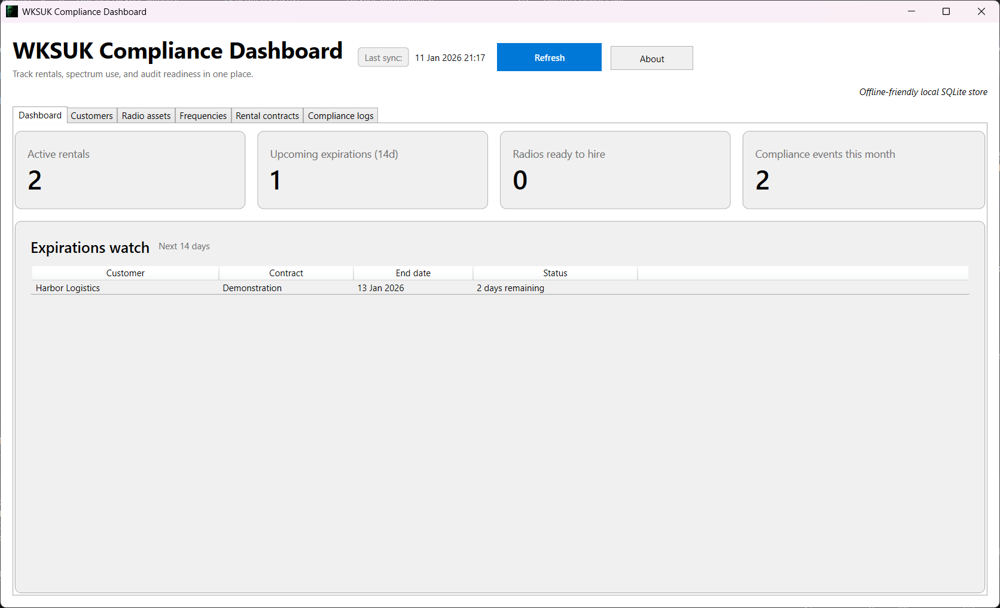

# WKSUK Compliance Dashboard

A Windows desktop app for managing radio-hire customers, spectrum assets, rental paperwork, and Ofcom compliance tasks in one place. It is built with .NET 9 (WPF) and ships with a local SQLite store so you can stay productive even when you are offline.



## Features
- **Compliance-first dashboard** that surfaces active hires, radios ready to deploy, expirations inside 14 days, and this month's compliance events.
- **Rich CRUD tooling** for customers, radio assets, licensed frequency channels, rental contracts, and compliance log entries.
- **Conflict guards** that prevent overlapping radio/frequency assignments and block destructive actions when linked data exists.
- **Seeded demo data** and automatic database provisioning under `%AppData%\LastShot\lastshot.db` for quick evaluation or resets.
- **MVVM architecture** powered by `CommunityToolkit.Mvvm`, async data services, and dependency injection via the generic host.

## Tech Stack
- .NET 9, WPF, XAML resource dictionaries
- Entity Framework Core + SQLite (`Microsoft.EntityFrameworkCore.Sqlite`)
- `CommunityToolkit.Mvvm` for observable models and async commands
- Generic Host (`Microsoft.Extensions.Hosting`, `Microsoft.Extensions.DependencyInjection`, `Microsoft.Extensions.Logging`)

## Getting Started
### Prerequisites
- Windows 10/11 with the .NET 9 SDK installed (`9.0.x` preview or later)
- (Optional) Visual Studio 2022 17.9+ with the .NET Desktop workload for a full designer/debugging experience

### Clone and run
```bash
git clone <your-fork-or-clone-url>
cd LastShot
dotnet build
dotnet run --project LastShot/LastShot.csproj
```
The first launch will create `%AppData%\LastShot\lastshot.db`, seed it with sample customers, radios, contracts, and logs, then open the dashboard window.

### Resetting the local database
Delete `%AppData%\LastShot\lastshot.db` (while the app is closed). The next run will recreate it with the default seed data.

## Project layout
- `LastShot/` – WPF application entry point, views, and application resources
  - `App.xaml.cs` – host/bootstrapper, SQLite configuration, seed data
  - `MainWindow.xaml*` – primary shell, dashboards, tabbed CRUD experiences
  - `AboutWindow.xaml*` – About dialog with project + author links
- `ViewModels/` – `MainViewModel` and supporting records (CommunityToolkit MVVM)
- `Models/` – Entity classes, enums, and dashboard DTOs shared between UI and EF Core
- `Data/` – `LastShotDbContext` plus configuration rules for EF Core
- `Services/` – `ComplianceDataService` + interface used by the view-model

## Roadmap ideas
- Add export/import for contracts and compliance logs
- Surface Ofcom notification deadlines inside the dashboard cards
- Automate packaging (MSIX) for easier distribution

## License
Released under the [MIT License](LICENSE).
